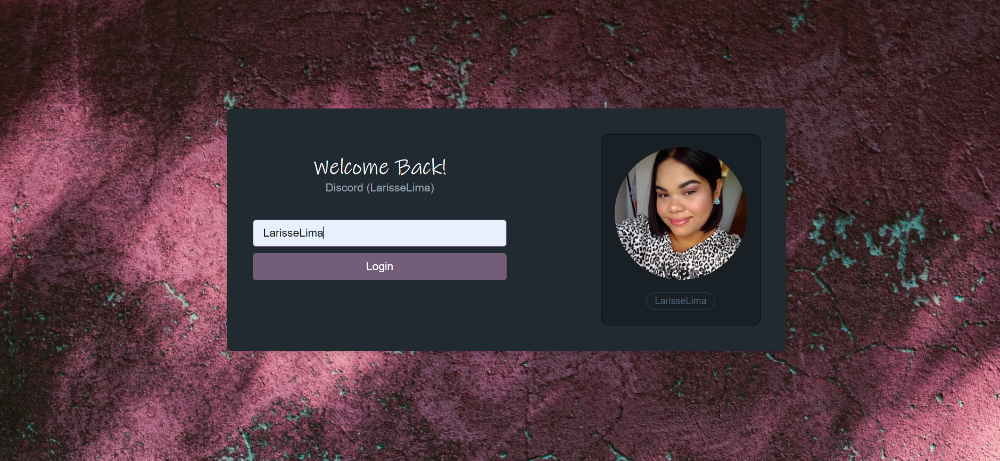

<h1 align="center">AluraCord</h1>


<h2 align="center">Tópicos 📋</h2>

   <p>
   
   - [Sobre 📖](#sobre-)
   - [Preview 💻](#preview-)
   - [Funcionalidades 🛠️](#Funcionalidades-%EF%B8%8F)
   - [Como Rodar 🤔](#como-usar-)
   - [Como Contribuir 💪](#como-contribuir-)
   - [Licença 📝](#licença-)

   </p>

---

<h2 align="center">Sobre 📖</h2>
   
<p align="center">
   AluraCord foi desenvolvido na imersão React da Alura.
</p>

---

<h2 align="center">Preview 💻</h2>

   <p align="center">
      
   </p>

---

<h2 align="center">Funcionalidades 🛠️</h2>

   <p>   
    - Login com Github,<br>
    - Chat Real time,<br>
    - Enavio de stickers<br>
- Entre várias outras coisas incríveis!
   </p>

---

<h2 align="center">Como Rodar 🤔</h2>

   ```
   - Clone esse repositório:
   $ git clone https://github.com/LarisseLima/discord 

   - Entre no diretório:
   $ cd discord

   - Instale as dependências:
   $ npm i OU yarn install

   - Rode o projeto: 
   $ npm run dev OU yarn dev
   ```

---

<h2 align="center">Como Contribuir 💪</h2>

   ```
   - Fork o projeto 

   - Cria uma nova branch com suas mudanças:
   $ git checkout -b my-feature

   - Salve suas mudanças e crie uma mensagem de commit falando o que fez:
   $ git commit -m "feature: My new feature"

   - Envie suas mudanças:
   $ git push origin my-feature
   ```

---

<h2 align="center">Licença 📝</h2>

<p align="center">
   Este repositório está sob licença MIT. Você pode ver o arquivo <a href="">LICENSE</a> para mais detalhes. 😉
</p>

   ---

   >Esse projeto foi desenvolvido com ❤️ por **[@Larisse Lima](https://www.linkedin.com/in/larisselima/)**, na #ImersãoReact da **[Alura](https://www.alura.com.br/)**.<br>
   Se isso te ajudou, dê uma ⭐, isso vai me ajudar também! 😉

---
